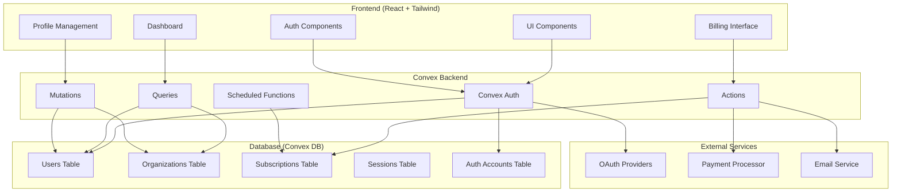

# Design Document

## Overview

This design document outlines the architecture for a comprehensive multi-organization SaaS application template built with React.js, Tailwind CSS, and Convex DB. The application provides a production-ready foundation with essential SaaS functionality including authentication, user management, subscription billing, security settings, and a modern dashboard interface.

The architecture emphasizes security, scalability, and modularity through:
- **Multi-organization data isolation** at the database level
- **Comprehensive authentication** with multiple providers and security features
- **Modern React architecture** with reusable components and hooks
- **Convex backend** for real-time data and serverless functions
- **Docker containerization** for consistent deployment

## Architecture

### High-Level Architecture



### Multi-Organization Architecture

The application implements a **shared database, isolated data** multi-organization model:

1. **Organization Isolation**: All data queries include organization context filtering
2. **Row-Level Security**: Database queries automatically filter by organization ID
3. **Organization Context**: User sessions maintain current organization context
4. **Cross-Organization Access**: Users can belong to multiple organizations with role-based permissions

### Technology Stack

- **Frontend**: React 18, TypeScript, Tailwind CSS, Vite
- **Backend**: Convex (serverless functions, real-time database)
- **Authentication**: Convex Auth with multiple providers
- **Styling**: Tailwind CSS with custom design system
- **State Management**: Convex React hooks for server state
- **Containerization**: Docker for both frontend and backend

## Components and Interfaces

### Frontend Component Architecture

```
src/
├── components/
│   ├── ui/                    # Reusable UI components
│   │   ├── Button.tsx
│   │   ├── Input.tsx
│   │   ├── Modal.tsx
│   │   └── ...
│   ├── auth/                  # Authentication components
│   │   ├── LoginForm.tsx
│   │   ├── SignupForm.tsx
│   │   ├── OAuthButtons.tsx
│   │   └── ProtectedRoute.tsx
│   ├── dashboard/             # Dashboard components
│   │   ├── DashboardLayout.tsx
│   │   ├── MetricsCard.tsx
│   │   ├── ActivityFeed.tsx
│   │   └── ...
│   ├── profile/               # Profile management
│   │   ├── ProfileForm.tsx
│   │   ├── SecuritySettings.tsx
│   │   ├── TwoFactorSetup.tsx
│   │   └── ...
│   ├── billing/               # Billing components
│   │   ├── SubscriptionCard.tsx
│   │   ├── PaymentMethod.tsx
│   │   ├── BillingHistory.tsx
│   │   └── ...
│   └── organization/          # Multi-organization components
│       ├── OrganizationSwitcher.tsx
│       ├── UserManagement.tsx
│       └── InviteUser.tsx
├── hooks/                     # Custom React hooks
│   ├── useCurrentUser.ts
│   ├── useCurrentOrganization.ts
│   ├── useSubscription.ts
│   └── ...
├── lib/                       # Utility functions
│   ├── utils.ts
│   ├── validations.ts
│   └── constants.ts
└── types/                     # TypeScript type definitions
    ├── auth.ts
    ├── organization.ts
    └── subscription.ts
```

### Backend Architecture (Convex)

```
convex/
├── auth.ts                    # Authentication configuration
├── schema.ts                  # Database schema definition
├── users.ts                   # User-related functions
├── organizations.ts           # Organization management functions
├── subscriptions.ts           # Billing and subscription functions
├── security.ts                # Security-related functions
├── dashboard.ts               # Dashboard data functions
├── notifications.ts           # Email and notification functions
├── crons.ts                   # Scheduled functions
├── http.ts                    # HTTP endpoints for webhooks
└── lib/
    ├── auth.ts                # Authentication utilities
    ├── organization.ts        # Organization utilities
    └── validation.ts          # Input validation
```

### Key Interfaces

#### User Interface
```typescript
interface User {
  _id: Id<"users">;
  email: string;
  name: string;
  profilePicture?: string;
  emailVerified: boolean;
  twoFactorEnabled: boolean;
  createdAt: number;
  updatedAt: number;
}
```

#### Organization Interface
```typescript
interface Organization {
  _id: Id<"organizations">;
  name: string;
  slug: string;
  ownerId: Id<"users">;
  subscriptionId?: Id<"subscriptions">;
  settings: OrganizationSettings;
  createdAt: number;
  updatedAt: number;
}
```

#### Subscription Interface
```typescript
interface Subscription {
  _id: Id<"subscriptions">;
  organizationId: Id<"organizations">;
  planId: string;
  status: "active" | "canceled" | "past_due" | "trialing";
  currentPeriodStart: number;
  currentPeriodEnd: number;
  paymentMethodId?: string;
  createdAt: number;
  updatedAt: number;
}
```

## Data Models

### Database Schema

```typescript
// convex/schema.ts
export default defineSchema({
  users: defineTable({
    email: v.string(),
    name: v.string(),
    profilePicture: v.optional(v.string()),
    emailVerified: v.boolean(),
    twoFactorEnabled: v.boolean(),
    twoFactorSecret: v.optional(v.string()),
    createdAt: v.number(),
    updatedAt: v.number(),
  })
    .index("by_email", ["email"])
    .index("by_created_at", ["createdAt"]),

  organizations: defineTable({
    name: v.string(),
    slug: v.string(),
    ownerId: v.id("users"),
    subscriptionId: v.optional(v.id("subscriptions")),
    settings: v.object({
      allowUserInvites: v.boolean(),
      requireEmailVerification: v.boolean(),
      sessionTimeout: v.number(),
    }),
    createdAt: v.number(),
    updatedAt: v.number(),
  })
    .index("by_slug", ["slug"])
    .index("by_owner", ["ownerId"])
    .index("by_created_at", ["createdAt"]),

  organizationMembers: defineTable({
    organizationId: v.id("organizations"),
    userId: v.id("users"),
    role: v.union(v.literal("owner"), v.literal("admin"), v.literal("member")),
    invitedBy: v.optional(v.id("users")),
    invitedAt: v.optional(v.number()),
    joinedAt: v.optional(v.number()),
    status: v.union(v.literal("active"), v.literal("invited"), v.literal("suspended")),
  })
    .index("by_organization", ["organizationId"])
    .index("by_user", ["userId"])
    .index("by_organization_user", ["organizationId", "userId"]),

  subscriptions: defineTable({
    organizationId: v.id("organizations"),
    planId: v.string(),
    status: v.union(
      v.literal("active"),
      v.literal("canceled"),
      v.literal("past_due"),
      v.literal("trialing")
    ),
    currentPeriodStart: v.number(),
    currentPeriodEnd: v.number(),
    paymentMethodId: v.optional(v.string()),
    externalSubscriptionId: v.string(),
    createdAt: v.number(),
    updatedAt: v.number(),
  })
    .index("by_organization", ["organizationId"])
    .index("by_status", ["status"])
    .index("by_external_id", ["externalSubscriptionId"]),

  sessions: defineTable({
    userId: v.id("users"),
    organizationId: v.optional(v.id("organizations")),
    deviceInfo: v.string(),
    ipAddress: v.string(),
    userAgent: v.string(),
    lastActivity: v.number(),
    expiresAt: v.number(),
    createdAt: v.number(),
  })
    .index("by_user", ["userId"])
    .index("by_organization", ["organizationId"])
    .index("by_expires_at", ["expiresAt"]),

  auditLogs: defineTable({
    organizationId: v.id("organizations"),
    userId: v.id("users"),
    action: v.string(),
    resource: v.string(),
    resourceId: v.optional(v.string()),
    metadata: v.optional(v.any()),
    ipAddress: v.string(),
    userAgent: v.string(),
    createdAt: v.number(),
  })
    .index("by_organization", ["organizationId"])
    .index("by_user", ["userId"])
    .index("by_created_at", ["createdAt"]),

  // Convex Auth tables
  authAccounts: defineTable({
    userId: v.id("users"),
    provider: v.string(),
    providerAccountId: v.string(),
    type: v.union(v.literal("oauth"), v.literal("email"), v.literal("credentials")),
    accessToken: v.optional(v.string()),
    refreshToken: v.optional(v.string()),
    expiresAt: v.optional(v.number()),
    tokenType: v.optional(v.string()),
    scope: v.optional(v.string()),
    idToken: v.optional(v.string()),
    sessionState: v.optional(v.string()),
  })
    .index("by_user", ["userId"])
    .index("by_provider_account", ["provider", "providerAccountId"]),

  authSessions: defineTable({
    userId: v.id("users"),
    sessionToken: v.string(),
    expires: v.number(),
  })
    .index("by_user", ["userId"])
    .index("by_session_token", ["sessionToken"]),

  authVerificationTokens: defineTable({
    identifier: v.string(),
    token: v.string(),
    expires: v.number(),
  })
    .index("by_identifier", ["identifier"])
    .index("by_token", ["token"]),
});
```

### Data Relationships

1. **Users ↔ Organizations**: Many-to-many through `organizationMembers`
2. **Organizations ↔ Subscriptions**: One-to-one relationship
3. **Users ↔ Sessions**: One-to-many relationship
4. **Users ↔ AuthAccounts**: One-to-many for OAuth providers
5. **Organizations ↔ AuditLogs**: One-to-many for activity tracking

## Error Handling

### Frontend Error Handling

```typescript
// Error boundary for React components
class ErrorBoundary extends React.Component {
  // Handle React component errors
}

// API error handling
const useApiError = () => {
  const handleError = (error: ConvexError) => {
    // Log error, show toast notification
    // Redirect to login if authentication error
  };
  return { handleError };
};
```

### Backend Error Handling

```typescript
// Custom error types
export class TenantAccessError extends Error {
  constructor(message: string) {
    super(message);
    this.name = "TenantAccessError";
  }
}

export class SubscriptionError extends Error {
  constructor(message: string) {
    super(message);
    this.name = "SubscriptionError";
  }
}

// Error handling in Convex functions
export const secureQuery = query({
  handler: async (ctx, args) => {
    try {
      const user = await getCurrentUser(ctx);
      if (!user) throw new Error("Unauthorized");
      
      // Query logic
    } catch (error) {
      console.error("Query error:", error);
      throw error;
    }
  }
});
```

## Testing Strategy

### Frontend Testing

1. **Unit Tests**: Jest + React Testing Library
   - Component rendering and behavior
   - Custom hooks functionality
   - Utility functions

2. **Integration Tests**: 
   - Authentication flows
   - Form submissions
   - API interactions

3. **E2E Tests**: Playwright
   - Complete user journeys
   - Multi-tenant scenarios
   - Payment flows

### Backend Testing

1. **Unit Tests**: Convex Test framework
   - Individual function testing
   - Database operations
   - Authentication logic

2. **Integration Tests**:
   - Multi-function workflows
   - External service integrations
   - Webhook handling

### Testing Structure

```
tests/
├── frontend/
│   ├── components/
│   ├── hooks/
│   ├── integration/
│   └── e2e/
├── backend/
│   ├── functions/
│   ├── auth/
│   └── integration/
└── fixtures/
    ├── users.ts
    ├── tenants.ts
    └── subscriptions.ts
```

## Security Considerations

### Authentication Security

1. **Multi-Factor Authentication**: TOTP-based 2FA with backup codes
2. **Session Management**: Secure session tokens with expiration
3. **OAuth Security**: Proper redirect URI validation
4. **Password Security**: Scrypt hashing with salt

### Data Security

1. **Tenant Isolation**: All queries filtered by tenant context
2. **Input Validation**: Comprehensive validation using Convex validators
3. **SQL Injection Prevention**: Convex's type-safe queries
4. **XSS Prevention**: React's built-in XSS protection + CSP headers

### API Security

1. **Rate Limiting**: Convex built-in rate limiting
2. **CORS Configuration**: Proper origin validation
3. **Webhook Security**: Signature verification for payment webhooks
4. **Audit Logging**: Comprehensive activity tracking

### Infrastructure Security

1. **Environment Variables**: Secure secret management
2. **HTTPS Enforcement**: SSL/TLS for all communications
3. **Container Security**: Minimal Docker images with security scanning
4. **Access Control**: Principle of least privilege

## Performance Optimization

### Frontend Performance

1. **Code Splitting**: Route-based and component-based splitting
2. **Lazy Loading**: Dynamic imports for non-critical components
3. **Caching**: React Query for server state caching
4. **Bundle Optimization**: Tree shaking and minification

### Backend Performance

1. **Database Indexing**: Strategic indexes for common queries
2. **Query Optimization**: Efficient Convex queries with proper filtering
3. **Caching**: Convex's built-in caching mechanisms
4. **Background Jobs**: Scheduled functions for heavy operations

### Monitoring and Analytics

1. **Performance Monitoring**: Real-time performance metrics
2. **Error Tracking**: Comprehensive error logging and alerting
3. **Usage Analytics**: User behavior and feature usage tracking
4. **Health Checks**: Application and database health monitoring

## Deployment Architecture

### Container Strategy

```dockerfile
# Frontend Dockerfile
FROM node:18-alpine
WORKDIR /app
COPY package*.json ./
RUN npm ci --only=production
COPY . .
RUN npm run build
EXPOSE 3000
CMD ["npm", "start"]

# Backend is handled by Convex Cloud
```

### Environment Configuration

```yaml
# docker-compose.yml
version: '3.8'
services:
  frontend:
    build: .
    ports:
      - "3000:3000"
    environment:
      - VITE_CONVEX_URL=${CONVEX_URL}
      - VITE_SITE_URL=${SITE_URL}
    depends_on:
      - convex-dev
```

### Scaling Strategy

1. **Horizontal Scaling**: Multiple frontend container instances
2. **Load Balancing**: Nginx or cloud load balancer
3. **CDN Integration**: Static asset delivery optimization
4. **Database Scaling**: Convex handles backend scaling automatically

This design provides a solid foundation for a production-ready multi-tenant SaaS application with modern architecture, comprehensive security, and scalable deployment options.