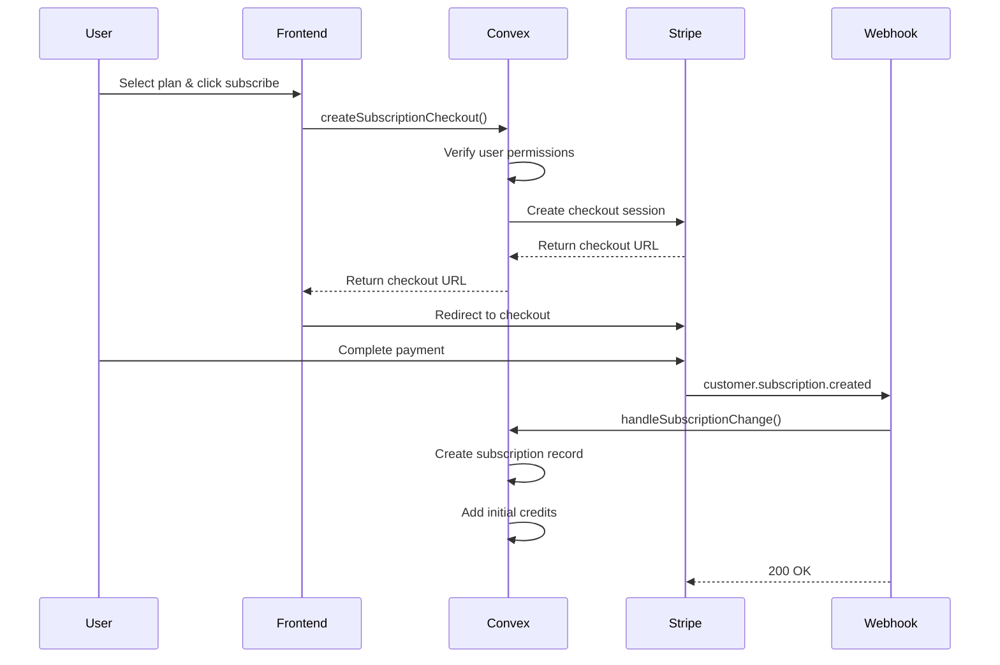
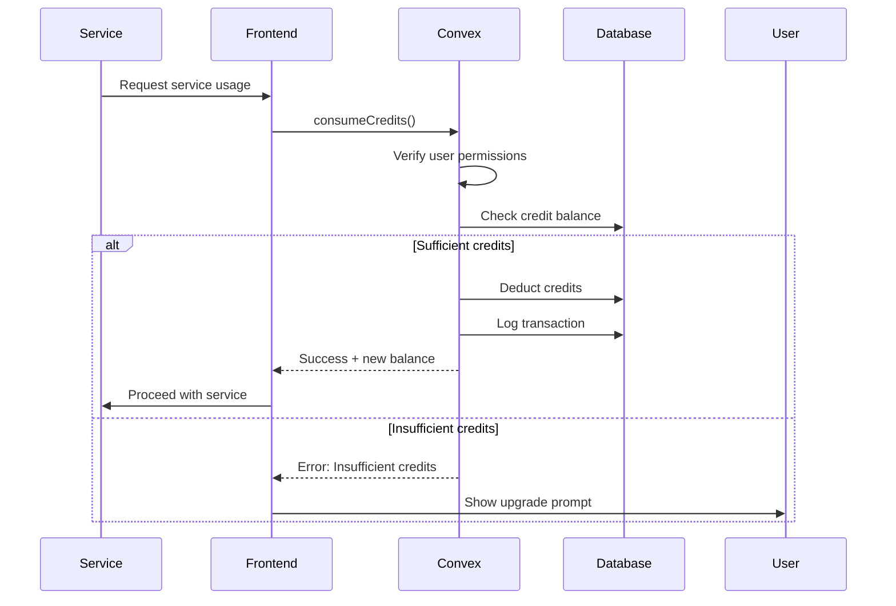
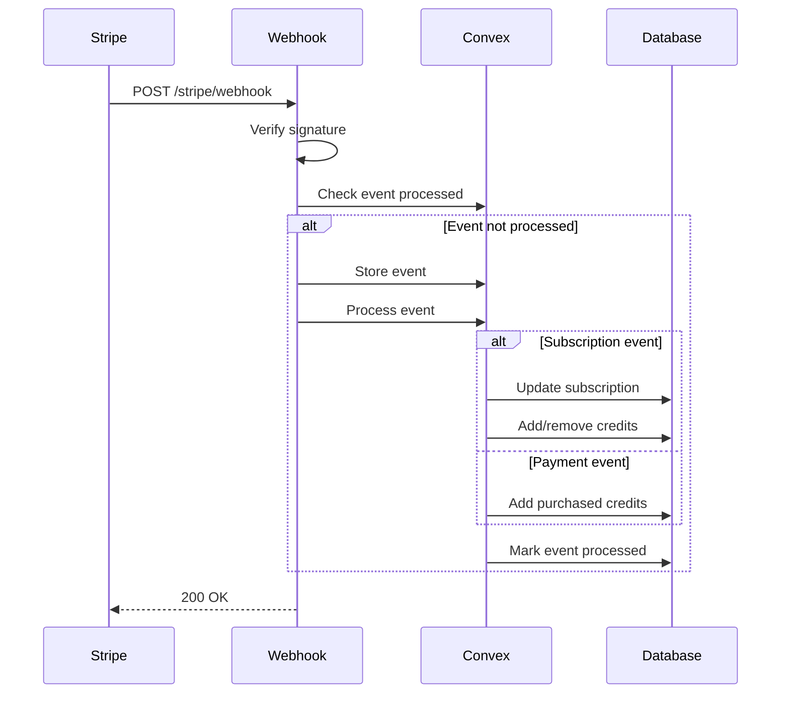

# Multitenant SaaS Subscription System - Technical Deep Dive

## Executive Summary

This document provides a comprehensive technical analysis of the subscription and payment system implemented in this multitenant SaaS application. The system leverages Convex as the backend database and real-time platform, Stripe for payment processing, and Next.js for the frontend, creating a robust credit-based billing architecture.

## System Architecture Overview

### Technology Stack
- **Backend**: Convex (serverless database + real-time functions)
- **Payment Processing**: Stripe (subscriptions, one-time payments, webhooks)
- **Frontend**: Next.js 15 with React 19
- **Authentication**: Convex Auth with multiple OAuth providers
- **Styling**: Tailwind CSS

### Core Components
1. **Database Layer**: Convex schema with 8 core tables for subscription management
2. **Business Logic Layer**: Convex functions for subscription and credit operations
3. **Payment Integration Layer**: Stripe API integration with webhook handling
4. **Frontend Layer**: React components for billing UI and user interactions

## Data Architecture & Responsibilities

### Database Schema Deep Dive

This section provides a comprehensive explanation of each subscription-related table, what it represents, and how it's used in the system.

#### 1. `subscriptions` Table

**What it represents:** The active subscription state for each organization

```typescript
subscriptions: defineTable({
  organizationId: v.id("organizations"),     // Which org owns this subscription
  stripeSubscriptionId: v.string(),          // Stripe's ID for this subscription
  stripeCustomerId: v.string(),              // Stripe's customer ID
  stripePriceId: v.string(),                 // Which Stripe price they're paying
  planId: v.string(),                        // Your internal plan identifier
  status: v.union(/* subscription statuses */), // Current subscription state
  currentPeriodStart: v.number(),            // When current billing period started
  currentPeriodEnd: v.number(),              // When current billing period ends
  cancelAtPeriodEnd: v.boolean(),            // Will it cancel at period end?
  trialEnd: v.optional(v.number()),          // When trial ends (if applicable)
  createdAt: v.number(),
  updatedAt: v.number(),
})
```

**Purpose:**
- **Single source of truth** for each organization's subscription status
- **Syncs Stripe state** with your application state
- **Enables subscription-based feature gating** in your app

**How it's used:**
```typescript
// Check if org has active subscription
const subscription = await ctx.db
  .query("subscriptions")
  .withIndex("by_organization", q => q.eq("organizationId", orgId))
  .first();

if (subscription?.status === "active") {
  // Allow premium features
}

// Updated by Stripe webhooks when subscription changes
await ctx.db.patch(subscriptionId, {
  status: "canceled",
  updatedAt: Date.now()
});
```

**Your Responsibilities:**
- Maintain subscription-to-organization mapping
- Track internal plan configurations
- Sync subscription status from Stripe webhooks
- Handle subscription lifecycle events

#### 2. `subscriptionPlans` Table

**What it represents:** Your product catalog - the plans customers can choose from

```typescript
subscriptionPlans: defineTable({
  planId: v.string(),                    // Your internal ID ("starter", "pro", "enterprise")
  name: v.string(),                      // Display name ("Starter Plan")
  description: v.string(),               // Marketing description
  stripePriceIdMonthly: v.string(),      // Stripe price ID for monthly billing
  stripePriceIdYearly: v.string(),       // Stripe price ID for yearly billing
  monthlyPrice: v.number(),              // Price in cents (cached from Stripe)
  yearlyPrice: v.number(),               // Yearly price in cents
  currency: v.string(),                  // "USD", "EUR", etc.
  creditsIncluded: v.number(),           // How many credits per billing period
  features: v.array(v.string()),         // List of features for this plan
  maxUsers: v.optional(v.number()),      // User limits (if any)
  maxProjects: v.optional(v.number()),   // Project limits (if any)
  isActive: v.boolean(),                 // Can customers subscribe to this?
  sortOrder: v.number(),                 // Display order on pricing page
})
```

**Purpose:**
- **Product catalog management** - define what you're selling
- **Feature configuration** - what each plan includes
- **Pricing display** - show prices on your website
- **Business logic** - determine what users can access

**How it's used:**
```typescript
// Display available plans on pricing page
const plans = await ctx.db
  .query("subscriptionPlans")
  .withIndex("by_active", q => q.eq("isActive", true))
  .order("asc") // by sortOrder
  .collect();

// Check plan limits
const userPlan = await getPlanForOrganization(orgId);
if (currentUsers >= userPlan.maxUsers) {
  throw new Error("User limit reached for your plan");
}

// Add credits when subscription renews
await addCredits(orgId, plan.creditsIncluded, "earned");
```

**Your Responsibilities:**
- Define product offerings and pricing tiers
- Configure feature sets for each plan
- Set usage limits and quotas
- Manage plan availability and ordering

#### 3. `credits` Table

**What it represents:** Current credit balance and usage summary for each organization

```typescript
credits: defineTable({
  organizationId: v.id("organizations"),  // Which org these credits belong to
  balance: v.number(),                    // Current available credits
  totalEarned: v.number(),                // Lifetime credits from subscriptions
  totalPurchased: v.number(),             // Lifetime credits bought separately
  totalUsed: v.number(),                  // Lifetime credits consumed
  lastUpdated: v.number(),                // When balance last changed
})
```

**Purpose:**
- **Real-time balance tracking** - how many credits org has right now
- **Usage analytics** - understand credit consumption patterns
- **Business intelligence** - track earned vs purchased vs used credits

**How it's used:**
```typescript
// Check if org has enough credits before expensive operation
const credits = await ctx.db
  .query("credits")
  .withIndex("by_organization", q => q.eq("organizationId", orgId))
  .first();

if (!credits || credits.balance < requiredCredits) {
  throw new Error("Insufficient credits");
}

// Deduct credits when service is used
await ctx.db.patch(credits._id, {
  balance: credits.balance - usedCredits,
  totalUsed: credits.totalUsed + usedCredits,
  lastUpdated: Date.now()
});

// Display credit status in UI
const creditStatus = credits.balance < 100 ? "low" : "good";
```

**Your Responsibilities:**
- Credit allocation and consumption logic
- Real-time balance management
- Usage tracking and analytics
- Credit expiration policies (if implemented)

#### 4. `creditTransactions` Table

**What it represents:** Complete audit trail of every credit change

```typescript
creditTransactions: defineTable({
  organizationId: v.id("organizations"),  // Which org
  type: v.union(                          // What kind of transaction
    v.literal("earned"),     // From subscription renewal
    v.literal("purchased"),  // Bought additional credits
    v.literal("used"),       // Consumed by services
    v.literal("refunded"),   // Credits refunded
    v.literal("expired"),    // Credits expired (if you implement expiration)
    v.literal("adjustment")  // Manual admin adjustment
  ),
  amount: v.number(),                     // How many credits (positive or negative)
  description: v.string(),                // Human-readable description
  metadata: v.optional(v.object({         // Additional context
    subscriptionId: v.optional(v.string()),        // If from subscription
    stripePaymentIntentId: v.optional(v.string()), // If from purchase
    serviceUsed: v.optional(v.string()),           // Which service consumed credits
    userId: v.optional(v.id("users")),             // Who triggered this
  })),
  createdAt: v.number(),
})
```

**Purpose:**
- **Complete audit trail** - every credit change is logged
- **Compliance** - financial audit requirements
- **Debugging** - trace credit discrepancies
- **Analytics** - understand usage patterns
- **Customer support** - explain credit changes to customers

**How it's used:**
```typescript
// Log every credit change
await ctx.db.insert("creditTransactions", {
  organizationId: orgId,
  type: "used",
  amount: -50, // Negative for consumption
  description: "AI text generation - 500 tokens",
  metadata: {
    serviceUsed: "ai-text-generation",
    userId: currentUserId
  },
  createdAt: Date.now()
});

// Show transaction history to users
const history = await ctx.db
  .query("creditTransactions")
  .withIndex("by_organization", q => q.eq("organizationId", orgId))
  .order("desc") // Most recent first
  .take(50);

// Debug credit discrepancies
const totalEarned = transactions
  .filter(t => t.type === "earned")
  .reduce((sum, t) => sum + t.amount, 0);
```

**Your Responsibilities:**
- Maintain complete transaction history
- Provide audit trails for compliance
- Enable customer support investigations
- Support business analytics and reporting

#### 5. `creditPackages` Table

**What it represents:** One-time credit purchase options (like "buy 1000 credits for $25")

```typescript
creditPackages: defineTable({
  packageId: v.string(),          // Your internal ID ("credits_1000")
  name: v.string(),               // Display name ("1,000 Credits")
  description: v.string(),        // Marketing description
  stripePriceId: v.string(),      // Stripe price ID for this package
  credits: v.number(),            // How many credits in this package
  price: v.number(),              // Price in cents
  currency: v.string(),           // "USD", "EUR", etc.
  isActive: v.boolean(),          // Can customers buy this?
  sortOrder: v.number(),          // Display order
})
```

**Purpose:**
- **Upsell opportunities** - when users run low on credits
- **Flexible pricing** - different credit amounts at different rates
- **Revenue optimization** - encourage larger purchases with better rates

**How it's used:**
```typescript
// Display credit packages when user is low on credits
const packages = await ctx.db
  .query("creditPackages")
  .withIndex("by_active", q => q.eq("isActive", true))
  .order("asc")
  .collect();

// Create Stripe checkout for credit purchase
const selectedPackage = await ctx.db
  .query("creditPackages")
  .withIndex("by_package_id", q => q.eq("packageId", "credits_1000"))
  .first();

// Add credits when purchase completes (via webhook)
await addCredits(orgId, selectedPackage.credits, "purchased");
```

**Your Responsibilities:**
- Define credit package offerings
- Set pricing and credit amounts
- Manage package availability
- Optimize for revenue and user experience

#### 6. `stripeEvents` Table

**What it represents:** Webhook event tracking for idempotency and debugging

```typescript
stripeEvents: defineTable({
  stripeEventId: v.string(),      // Stripe's unique event ID
  eventType: v.string(),          // "customer.subscription.created", etc.
  processed: v.boolean(),         // Have we handled this event?
  processedAt: v.optional(v.number()), // When we processed it
  data: v.any(),                  // Full Stripe event payload
  createdAt: v.number(),
})
```

**Purpose:**
- **Prevent duplicate processing** - webhooks can be sent multiple times
- **Debugging** - see exactly what Stripe sent
- **Compliance** - audit trail of all billing events
- **Recovery** - replay events if needed

**How it's used:**
```typescript
// Check if we've already processed this webhook
const existingEvent = await ctx.db
  .query("stripeEvents")
  .withIndex("by_stripe_event_id", q => q.eq("stripeEventId", event.id))
  .first();

if (existingEvent?.processed) {
  return; // Already handled, skip
}

// Store the event
await ctx.db.insert("stripeEvents", {
  stripeEventId: event.id,
  eventType: event.type,
  processed: false,
  data: event.data,
  createdAt: Date.now()
});

// Process the event...
// Mark as processed
await ctx.db.patch(eventRecord._id, {
  processed: true,
  processedAt: Date.now()
});
```

**Your Responsibilities:**
- Ensure idempotent webhook processing
- Maintain audit trail of billing events
- Support debugging and troubleshooting
- Enable event replay for recovery scenarios

### How These Tables Work Together

#### Subscription Flow:
1. **User selects plan** → Query `subscriptionPlans`
2. **Stripe checkout created** → References plan's `stripePriceId`
3. **Payment succeeds** → Webhook creates record in `subscriptions`
4. **Credits allocated** → Update `credits` table, log in `creditTransactions`
5. **Event logged** → Store webhook in `stripeEvents`

#### Credit Usage Flow:
1. **User uses service** → Check `credits.balance`
2. **Deduct credits** → Update `credits` table
3. **Log transaction** → Insert into `creditTransactions`
4. **Low balance?** → Show `creditPackages` for purchase

#### Analytics & Reporting:
- **Revenue tracking** → Sum `creditTransactions` where `type = "purchased"`
- **Usage patterns** → Analyze `creditTransactions` by `serviceUsed`
- **Plan effectiveness** → Compare `subscriptions` status with `credits` usage
- **Customer health** → Monitor `credits.balance` trends

This architecture provides complete visibility into your subscription business while maintaining data integrity and audit trails for compliance.

### What Stripe Maintains

#### 1. Payment Processing
- **Customer Management**: Customer records, payment methods, billing addresses
- **Subscription Billing**: Recurring charge processing, invoice generation
- **Payment Collection**: Card processing, failed payment handling, dunning management
- **Tax Calculation**: Automatic tax calculation based on customer location
- **Compliance**: PCI compliance, regulatory requirements

#### 2. Pricing & Products
- **Product Catalog**: Product definitions and metadata
- **Price Objects**: Pricing tiers, currencies, billing intervals
- **Promotional Codes**: Discounts, coupons, promotional pricing
- **Metered Billing**: Usage-based billing (if implemented)

#### 3. Subscription Lifecycle
- **Billing Cycles**: Automatic renewal, proration calculations
- **Trial Management**: Trial period tracking and conversion
- **Subscription Changes**: Plan upgrades/downgrades, quantity changes
- **Cancellation Handling**: Immediate vs. end-of-period cancellation

## Detailed Data Flow Analysis

### 1. Subscription Creation Flow



**Key Security Points:**
- User authorization verified before checkout creation
- Organization membership validated
- Webhook signature verification prevents tampering
- Idempotent webhook processing prevents duplicate processing

### 2. Credit Consumption Flow



### 3. Webhook Processing Flow



## Security Analysis

### ✅ Implemented Security Measures

#### 1. Webhook Security
```typescript
// Signature verification in convex/http.ts
const sig = request.headers.get("stripe-signature");
event = stripe.webhooks.constructEvent(body, sig, endpointSecret);
```
- **Strength**: Prevents webhook spoofing and replay attacks
- **Implementation**: Proper signature verification using Stripe's SDK

#### 2. Authorization Controls
```typescript
// User permission verification in subscriptions.ts
const membership = await ctx.db
  .query("organizationMembers")
  .withIndex("by_user_organization", (q) => 
    q.eq("userId", userId).eq("organizationId", args.organizationId)
  )
  .filter((q) => q.eq(q.field("isActive"), true))
  .first();

if (!membership || (membership.role !== "owner" && membership.role !== "admin")) {
  throw new ConvexError("Not authorized");
}
```
- **Strength**: Role-based access control for billing operations
- **Implementation**: Proper membership validation before sensitive operations

#### 3. Input Validation
```typescript
// Convex validators ensure type safety
export const consumeCredits = mutation({
  args: {
    organizationId: v.id("organizations"),
    amount: v.number(),
    description: v.string(),
    serviceUsed: v.optional(v.string()),
  },
  // ...
});
```
- **Strength**: Type-safe input validation prevents injection attacks
- **Implementation**: Convex's built-in validation system

#### 4. Idempotent Processing
```typescript
// Event deduplication in webhook handler
const existingEvent = await ctx.runQuery(internal.stripe.getStripeEvent, {
  stripeEventId: event.id,
});

if (existingEvent && existingEvent.processed) {
  return new Response("Event already processed", { status: 200 });
}
```
- **Strength**: Prevents duplicate processing of webhook events
- **Implementation**: Event ID tracking with processed flag

### 🚨 Security Risks & Vulnerabilities

#### 1. HIGH RISK: Hardcoded Demo Organization ID
```typescript
// In src/app/dashboard/billing/page.tsx
const DEMO_ORG_ID = "demo_org_id" as Id<"organizations">;
```
**Risk**: All users could potentially access the same demo organization's billing
**Impact**: Data leakage, unauthorized billing operations
**Mitigation**: Implement proper organization context from authentication

#### 2. MEDIUM RISK: Missing Rate Limiting
**Risk**: No rate limiting on credit consumption or checkout creation
**Impact**: Potential abuse, excessive API calls to Stripe
**Mitigation**: Implement rate limiting on sensitive operations

#### 3. MEDIUM RISK: Insufficient Error Handling
```typescript
// In webhook handler - generic error responses
catch (error) {
  const err = error as Error;
  console.error(`Error processing webhook: ${err.message}`);
  return new Response(`Webhook processing error: ${err.message}`, { status: 500 });
}
```
**Risk**: Error messages might leak sensitive information
**Impact**: Information disclosure
**Mitigation**: Sanitize error messages, implement proper logging

#### 4. LOW RISK: Missing Audit Logging
**Risk**: Limited audit trail for administrative actions
**Impact**: Compliance issues, difficult forensics
**Mitigation**: Implement comprehensive audit logging


## Business Logic Analysis

### Credit System Design

#### Credit Allocation Strategy
1. **Subscription Credits**: Allocated at subscription creation and renewal
2. **Purchased Credits**: Added immediately upon successful payment
3. **Credit Consumption**: Deducted in real-time during service usage

#### Credit Types & Tracking
```typescript
type CreditTransactionType = 
  | "earned"      // From subscription renewal
  | "purchased"   // One-time credit purchase
  | "used"        // Consumed by services
  | "refunded"    // Refunded credits
  | "expired"     // Expired credits (not implemented)
  | "adjustment"; // Manual adjustment
```

### Subscription Plans Architecture

#### Plan Structure
- **Starter**: $29/month, 1,000 credits, 5 users
- **Pro**: $79/month, 5,000 credits, 25 users  
- **Enterprise**: $199/month, 15,000 credits, unlimited users

#### Credit Pricing Analysis
- **Subscription credits**: $0.029 - $0.0133 per credit (volume discount)
- **Purchased credits**: $0.018 - $0.03 per credit (better rates for larger packages)
- **Business model**: Encourages subscription commitment with better credit rates

## Performance Considerations

### Database Indexing Strategy
```typescript
// Efficient indexes for common queries
subscriptions: [
  "by_organization",           // Primary lookup
  "by_stripe_subscription",    // Webhook processing
  "by_status"                  // Status filtering
],
credits: [
  "by_organization"            // Organization-specific queries
],
creditTransactions: [
  "by_organization",           // Transaction history
  "by_created_at"              // Time-based queries
]
```

### Query Optimization
- **Real-time subscriptions**: Convex provides automatic real-time updates
- **Efficient pagination**: Implemented in credit transaction history
- **Cached plan data**: Subscription plans cached in database

## Scalability Analysis

### Current Limitations
1. **Single-region deployment**: Convex deployment in single region
2. **Webhook processing**: Sequential processing of webhook events
3. **Credit calculations**: Real-time calculations without caching

### Scaling Recommendations
1. **Implement credit caching**: Cache frequently accessed credit balances
2. **Batch webhook processing**: Process multiple events in batches
3. **Add monitoring**: Implement comprehensive monitoring and alerting
4. **Database sharding**: Consider sharding strategies for large-scale deployment

## Integration Points & Dependencies

### External Dependencies
1. **Stripe API**: Payment processing, subscription management
2. **Convex Platform**: Database, real-time functions, authentication
3. **Next.js**: Frontend framework and API routes

### Internal Dependencies
1. **Organization Management**: Multi-tenant isolation
2. **User Authentication**: Convex Auth integration
3. **Permission System**: Role-based access control

## Compliance & Regulatory Considerations

### Data Protection
- **PCI Compliance**: Handled by Stripe (no card data stored locally)
- **GDPR Compliance**: User data handling needs review
- **Data Retention**: Credit transaction history retention policy needed

### Financial Regulations
- **Revenue Recognition**: Subscription revenue recognition patterns
- **Tax Compliance**: Handled by Stripe Tax (if enabled)
- **Audit Requirements**: Transaction audit trail maintained

## Monitoring & Observability Gaps

### Missing Monitoring
1. **Credit consumption patterns**: No analytics on credit usage
2. **Subscription churn**: No churn analysis or prevention
3. **Payment failures**: Limited failed payment handling
4. **Performance metrics**: No performance monitoring

### Recommended Metrics
1. **Business Metrics**: MRR, churn rate, credit utilization
2. **Technical Metrics**: API response times, error rates
3. **Security Metrics**: Failed authentication attempts, suspicious activity

## Recommendations for Production

### Immediate Actions (High Priority)
1. **Fix demo organization ID**: Implement proper organization context
2. **Add rate limiting**: Prevent abuse of credit and checkout operations
3. **Improve error handling**: Sanitize error messages and add proper logging

### Short-term Improvements (Medium Priority)
1. **Add comprehensive monitoring**: Business and technical metrics
2. **Implement audit logging**: Full audit trail for compliance
3. **Add credit expiration**: Implement credit expiration policies
4. **Improve webhook resilience**: Add retry logic and dead letter queues

### Long-term Enhancements (Low Priority)
1. **Advanced analytics**: Credit usage patterns, subscription analytics
2. **Multi-currency support**: International expansion capabilities
3. **Advanced billing features**: Proration, usage-based billing
4. **Performance optimization**: Caching, query optimization

## Conclusion

The subscription system demonstrates a solid architectural foundation with proper separation of concerns between your application and Stripe. The credit-based billing model provides flexibility for usage-based services while maintaining predictable subscription revenue.

Key strengths include robust webhook handling, proper authorization controls, and comprehensive audit trails. However, several security vulnerabilities need immediate attention, particularly the hardcoded demo organization ID and missing rate limiting on sensitive operations.

The system is well-positioned for scaling but would benefit from enhanced monitoring, improved error handling, and additional security measures before production deployment.

**Overall Assessment**: Good architectural foundation with critical security issues that must be addressed before production use.